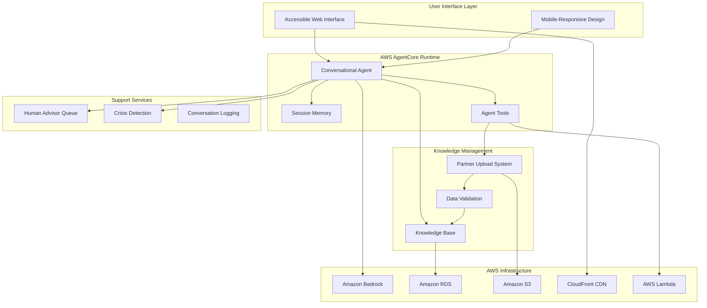

# Design Document: Citizen Services Platform

## Overview

The Citizen Services Platform is a comprehensive AI-powered system designed to help vulnerable UK citizens access government services and support resources. Built on AWS AgentCore, the platform provides an accessible, conversational interface that delivers both national and location-specific information while maintaining ethical AI practices and providing pathways to human support.

The system architecture emphasizes accessibility, security, and responsible AI deployment, with particular attention to serving vulnerable populations who may have varying levels of digital literacy and accessibility needs.

## Architecture

### High-Level Architecture



### Component Architecture

The platform follows a modular architecture with clear separation of concerns:

1. **Presentation Layer**: Accessible web interface with WCAG 2.1 AA compliance
2. **Agent Layer**: AWS AgentCore runtime managing conversational AI
3. **Knowledge Layer**: Structured data management for national and local information
4. **Support Layer**: Human escalation and crisis intervention systems
5. **Infrastructure Layer**: AWS managed services for scalability and reliability

## Components and Interfaces

### 1. Conversational Agent Interface

**Technology**: AWS Bedrock AgentCore with 8-hour session support
**Purpose**: Primary user interaction point for citizen queries

**Key Features**:
- Natural language processing for UK English dialects
- Context-aware responses based on user location and needs
- Responsible AI guardrails to prevent harmful advice
- Session persistence for complex multi-turn conversations

**Interface Specification**:
```typescript
interface ConversationalAgent {
  processQuery(query: string, context: UserContext): Promise<AgentResponse>
  escalateToHuman(reason: EscalationReason): Promise<EscalationTicket>
  detectCrisis(message: string): Promise<CrisisAssessment>
  maintainContext(sessionId: string): Promise<SessionContext>
}
```

### 2. Knowledge Base Management System

**Technology**: Amazon RDS with structured data schema
**Purpose**: Store and manage national and local service information

**Data Schema**:
- **National Services**: Benefits, welfare programs, government departments
- **Local Services**: Food banks, housing support, local council services
- **Crisis Resources**: Emergency contacts, helplines, immediate support
- **Partner Content**: Uploaded data from authorized organizations

**Interface Specification**:
```typescript
interface KnowledgeBase {
  queryNational(topic: ServiceCategory): Promise<ServiceInfo[]>
  queryLocal(topic: ServiceCategory, area: LocalArea): Promise<ServiceInfo[]>
  validateData(data: PartnerData): Promise<ValidationResult>
  updateContent(partnerId: string, data: ServiceData): Promise<UpdateResult>
}
```

### 3. Accessible User Interface

**Technology**: React with accessibility-first design principles
**Purpose**: Provide inclusive interface for all users

**Accessibility Features**:
- WCAG 2.1 AA compliance with 4.5:1 contrast ratios
- Color-blind friendly design using patterns and shapes alongside color
- Keyboard navigation support
- Screen reader compatibility
- Simple language and clear visual hierarchy

**Interface Components**:
- Chat interface with large, clear text
- High-contrast color scheme with alternative indicators
- Voice input/output capabilities
- Simplified navigation with clear labels

### 4. Partner Data Upload System

**Technology**: AWS Lambda with S3 storage
**Purpose**: Allow authorized partners to contribute data

**Upload Process**:
1. Partner authentication and authorization
2. Data format validation (JSON schema)
3. Content review and approval workflow
4. Integration into knowledge base
5. Version control and audit trail

**Interface Specification**:
```typescript
interface PartnerUpload {
  authenticate(credentials: PartnerCredentials): Promise<AuthToken>
  uploadData(data: ServiceData, token: AuthToken): Promise<UploadResult>
  validateFormat(data: unknown): Promise<ValidationResult>
  approveContent(uploadId: string): Promise<ApprovalResult>
}
```

### 5. Human Advisor Escalation System

**Technology**: AWS SQS with custom queue management
**Purpose**: Route complex cases to human support staff

**Escalation Triggers**:
- User explicitly requests human help
- Agent detects crisis language or urgent need
- Complex queries beyond agent capabilities
- User expresses dissatisfaction with AI responses

**Queue Management**:
- Priority routing based on urgency assessment
- Context transfer to human advisors
- Conversation history preservation
- Follow-up tracking and case management

## Data Models

### User Context Model
```typescript
interface UserContext {
  sessionId: string
  localArea?: LocalArea
  conversationHistory: Message[]
  accessibilityPreferences: AccessibilitySettings
  escalationHistory: EscalationRecord[]
}
```

### Service Information Model
```typescript
interface ServiceInfo {
  id: string
  name: string
  description: string
  category: ServiceCategory
  scope: 'national' | 'local'
  localArea?: LocalArea
  contactInfo: ContactDetails
  eligibilityCriteria: string[]
  applicationProcess: string[]
  lastUpdated: Date
  partnerId?: string
}
```

### Synthetic Data Model
```typescript
interface SyntheticDataset {
  benefits: BenefitInfo[]
  foodBanks: FoodBankInfo[]
  housingSupport: HousingInfo[]
  debtAdvice: DebtServiceInfo[]
  domesticViolence: DVSupportInfo[]
  localAreas: LocalAreaInfo[]
}
```

### Crisis Detection Model
```typescript
interface CrisisAssessment {
  riskLevel: 'low' | 'medium' | 'high' | 'immediate'
  indicators: string[]
  recommendedAction: CrisisAction
  emergencyContacts: EmergencyContact[]
}
```

Now I need to use the prework tool to analyze the acceptance criteria before writing the correctness properties:
## Correctness Properties

*A property is a characteristic or behavior that should hold true across all valid executions of a system—essentially, a formal statement about what the system should do. Properties serve as the bridge between human-readable specifications and machine-verifiable correctness guarantees.*

### Property Reflection

After analyzing all acceptance criteria, several properties can be consolidated to eliminate redundancy:

- Properties 2.1 and 2.4 both relate to data management and can be combined into a comprehensive data handling property
- Properties 3.1, 3.2, and 3.3 all relate to location-based information delivery and can be unified
- Properties 6.1 and 6.5 both address crisis detection and can be merged
- Properties 7.1 and 7.2 both cover escalation scenarios and can be combined

### Core Properties

**Property 1: Agent Query Processing**
*For any* citizen query, the Agent_Core should process the query and provide relevant information from the Knowledge_Base
**Validates: Requirements 1.2**

**Property 2: Safety Guardrails**
*For any* potentially harmful input, the Agent_Core should refuse to provide harmful advice and redirect to appropriate resources
**Validates: Requirements 1.5**

**Property 3: Data Management Round Trip**
*For any* valid partner data upload, the system should validate, store, and immediately make the data available to the Agent_Core
**Validates: Requirements 2.1, 2.4**

**Property 4: Data Categorization**
*For any* uploaded service data, the system should correctly categorize it as national or local area-specific based on its content
**Validates: Requirements 2.2**

**Property 5: Partner Authentication**
*For any* partner access attempt, the system should properly authenticate credentials and authorize only valid partners for data management operations
**Validates: Requirements 2.5**

**Property 6: Location-Based Information Delivery**
*For any* citizen query with location specified, the system should provide information relevant to that Local_Area and clearly distinguish between national and local information
**Validates: Requirements 3.1, 3.3**

**Property 7: Default National Information**
*For any* citizen query without location specified, the system should provide national information and prompt for location specification
**Validates: Requirements 3.2**

**Property 8: Local Data Fallback**
*For any* query where local information is unavailable, the system should provide national alternatives and explain the limitation
**Validates: Requirements 3.4**

**Property 9: Accessibility Compliance**
*For any* interface element, the system should meet WCAG 2.1 AA standards including proper contrast ratios and keyboard navigation support
**Validates: Requirements 4.1, 4.3, 4.4**

**Property 10: Color-Blind Accessibility**
*For any* visual information conveyed through color, the system should provide alternative indicators (patterns, shapes, or text) to ensure accessibility for color-blind users
**Validates: Requirements 4.2**

**Property 11: Synthetic Data Generation**
*For any* data generation request, the system should produce realistic synthetic data that reflects UK government service structures and includes coverage for all three Local_Areas
**Validates: Requirements 5.1, 5.2, 5.3, 5.4, 5.5**

**Property 12: Crisis Detection and Response**
*For any* input indicating crisis or distress, the Agent_Core should prioritize immediate safety resources, offer crisis support options, and suggest Human_Advisor escalation
**Validates: Requirements 6.1, 6.5**

**Property 13: Professional Boundaries**
*For any* query requesting legal or medical advice, the Agent_Core should avoid definitive recommendations and suggest appropriate professional consultation
**Validates: Requirements 6.2**

**Property 14: Uncertainty Communication**
*For any* query where information accuracy is uncertain, the Agent_Core should clearly state limitations and suggest Human_Advisor consultation
**Validates: Requirements 6.3**

**Property 15: Escalation Management**
*For any* escalation request (explicit or system-detected), the system should provide clear escalation options and transfer relevant conversation context to Human_Advisors
**Validates: Requirements 7.1, 7.2, 7.3**

**Property 16: Escalation Fallback**
*For any* escalation attempt when Human_Advisors are unavailable, the system should provide alternative support options and expected wait times
**Validates: Requirements 7.4**

**Property 17: Conversation Continuity**
*For any* escalation event, the system should maintain complete conversation history for continuity of care
**Validates: Requirements 7.5**

## Error Handling

### Error Categories and Responses

**1. User Input Errors**
- Invalid queries or malformed requests
- Response: Provide helpful guidance and suggest alternative phrasings
- Escalation: Offer human assistance if user continues to struggle

**2. System Availability Errors**
- Knowledge base unavailable or agent service down
- Response: Provide cached emergency contact information
- Escalation: Immediate escalation to emergency support channels

**3. Data Quality Errors**
- Incomplete or outdated information in knowledge base
- Response: Clearly state information limitations and last update dates
- Escalation: Suggest human advisor for most current information

**4. Crisis Detection Errors**
- False positives or missed crisis indicators
- Response: Err on the side of caution with crisis resources
- Escalation: Always provide crisis helpline numbers when in doubt

**5. Partner Data Errors**
- Invalid data formats or unauthorized uploads
- Response: Provide clear validation error messages
- Escalation: Contact partner administrators for resolution

### Error Recovery Strategies

**Graceful Degradation**:
- If local data is unavailable, fall back to national information
- If AI agent fails, provide static emergency contact information
- If escalation system fails, display emergency helpline numbers

**User Communication**:
- Always explain what went wrong in simple, non-technical language
- Provide alternative ways to get help
- Never leave users without any support options

**Monitoring and Alerting**:
- Real-time monitoring of system health and response quality
- Automated alerts for crisis detection failures
- Partner notification system for data validation issues

## Testing Strategy

### Dual Testing Approach

The platform requires both unit testing and property-based testing to ensure comprehensive coverage:

**Unit Tests**: Verify specific examples, edge cases, and error conditions
- Test specific crisis scenarios with known inputs and expected outputs
- Verify accessibility features with concrete test cases
- Test partner authentication with specific credential combinations
- Validate synthetic data generation with sample outputs

**Property Tests**: Verify universal properties across all inputs
- Test agent responses across randomly generated queries
- Verify accessibility compliance across randomly generated interface states
- Test data management with randomly generated partner uploads
- Validate crisis detection across varied input patterns

### Property-Based Testing Configuration

**Testing Framework**: Use fast-check for TypeScript/JavaScript property-based testing
**Test Configuration**: Minimum 100 iterations per property test
**Test Tagging**: Each property test must reference its design document property using the format:
`// Feature: citizen-services-platform, Property {number}: {property_text}`

### Testing Priorities

**Critical Path Testing**:
1. Crisis detection and response (Properties 12, 14)
2. Agent query processing and safety (Properties 1, 2)
3. Accessibility compliance (Properties 9, 10)
4. Human escalation pathways (Properties 15, 16, 17)

**Integration Testing**:
- End-to-end user journeys from query to resolution
- Partner data upload to citizen query workflows
- Crisis detection to human escalation flows
- Accessibility testing with assistive technologies

**Performance Testing**:
- Agent response times under load
- Knowledge base query performance
- Escalation system capacity testing
- Synthetic data generation performance

### Synthetic Data Testing

**Data Validation**:
- Verify generated data matches UK government service structures
- Test data completeness across all service categories
- Validate geographic distribution across three local areas
- Ensure data realism and consistency

**Data Integration Testing**:
- Test agent responses using only synthetic data
- Verify partner upload workflows with synthetic datasets
- Test location-based filtering with synthetic geographic data
- Validate crisis resource data accuracy and completeness

The testing strategy ensures that vulnerable citizens receive accurate, helpful, and safe assistance while maintaining system reliability and accessibility standards.