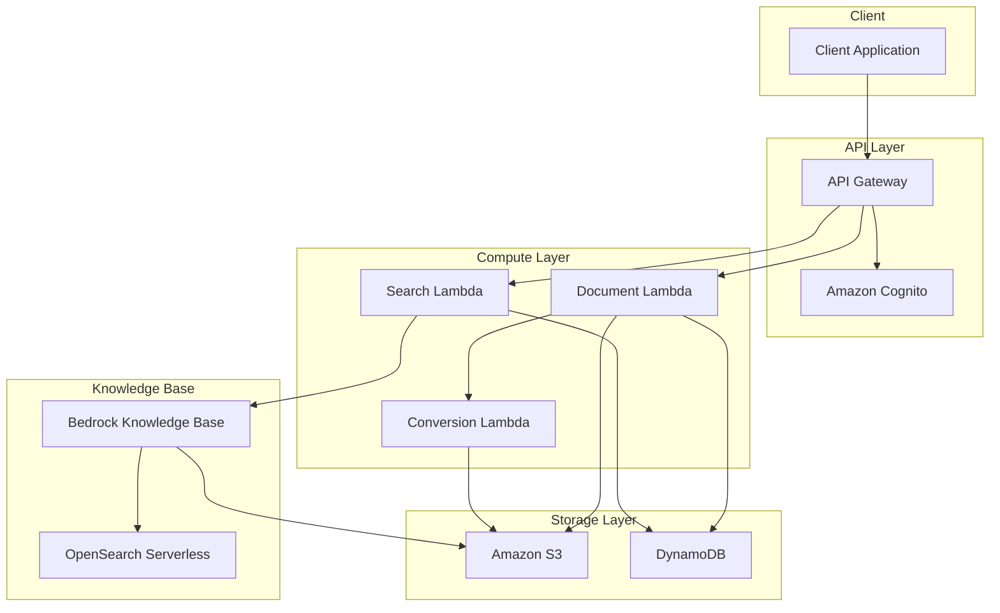

# Design Document: Document Management Backend

## Overview

This document describes the technical design for a serverless document management backend built on AWS. The system enables users to upload documents (PDF, Word, PowerPoint, Google Docs), attach metadata, and search documents via API. Bedrock Knowledge Bases handles text extraction and semantic search automatically. The architecture prioritizes cost efficiency using serverless components.

### Key AWS Services

- **Amazon S3**: Document storage with lifecycle policies
- **Amazon DynamoDB**: Metadata storage with on-demand capacity
- **AWS Lambda**: Serverless compute for business logic
- **Amazon API Gateway**: REST API endpoints
- **Amazon Cognito**: User authentication and authorization
- **Amazon Bedrock Knowledge Bases**: Automatic text extraction, chunking, and RAG-enabled semantic search
- **Amazon OpenSearch Serverless**: Vector store for embeddings

## Architecture



## Components and Interfaces

### 1. API Gateway

REST API with the following endpoints:

| Method | Endpoint | Description | Auth |
|--------|----------|-------------|------|
| POST | /documents | Upload document | Required |
| GET | /documents | List documents | Required |
| GET | /documents/{id} | Get document | Required |
| PUT | /documents/{id} | Update document | Required |
| DELETE | /documents/{id} | Delete document | Required |
| PATCH | /documents/{id}/metadata | Update metadata | Required |
| POST | /search | Search documents by metadata | Required |
| POST | /search/semantic | Semantic search via KB | Required |

### 2. Document Lambda

Handles document CRUD operations.

```typescript
interface DocumentUploadRequest {
  file?: Buffer;              // For direct upload
  googleDocsUrl?: string;     // For Google Docs
  metadata: DocumentMetadata;
}

interface DocumentMetadata {
  location: string;           // Required: where doc applies
  category?: string;          // Optional: custom category
  expiryDate?: string;        // Optional: ISO date string
  sensitivity?: number;       // Optional: 1-5 ranking (default: 3)
}

interface Document {
  id: string;
  userId: string;
  organizationId: string;
  fileName: string;
  fileExtension: string;
  s3Key: string;
  location: string;
  category?: string;
  expiryDate?: string;
  sensitivity: number;        // 1-5 ranking (default: 3)
  version: number;
  status: 'active' | 'processing' | 'failed';
  createdAt: string;
  updatedAt: string;
}
```

**Upload Flow:**
1. Validate file type and size
2. Generate unique document ID
3. For Google Docs: invoke Conversion Lambda to fetch and convert
4. For PowerPoint: invoke Conversion Lambda to convert to PDF
5. Upload file to S3 (in KB data source bucket)
6. Store metadata in DynamoDB
7. Bedrock KB automatically syncs and extracts text

### 3. Conversion Lambda

Handles Google Docs fetching and PowerPoint conversion (formats not natively supported by Bedrock KB).

```typescript
interface ConversionRequest {
  documentId: string;
  sourceType: 'google-docs' | 'powerpoint';
  sourceUrl?: string;         // For Google Docs
  s3Key?: string;             // For PowerPoint
}

interface ConversionResult {
  documentId: string;
  convertedS3Key: string;
  status: 'completed' | 'failed';
  errorMessage?: string;
}
```

**Conversion Strategy:**
- **Google Docs**: Fetch via Google Docs API export as PDF, store in S3
- **PowerPoint (.pptx)**: Convert to PDF using LibreOffice in Lambda layer

### 4. Search Lambda

Handles both metadata and semantic search.

```typescript
interface MetadataSearchRequest {
  location?: string;
  category?: string;
  fileExtension?: string;
  sensitivity?: number;       // Filter by sensitivity level
  minSensitivity?: number;    // Filter by minimum sensitivity
  maxSensitivity?: number;    // Filter by maximum sensitivity
  expiryDateBefore?: string;
  expiryDateAfter?: string;
  page?: number;
  pageSize?: number;
}

interface SemanticSearchRequest {
  query: string;
  filters?: {
    location?: string;
    category?: string;
  };
  maxResults?: number;
}

interface SearchResult {
  documents: DocumentSummary[];
  totalCount: number;
  page: number;
  pageSize: number;
}

interface SemanticSearchResult {
  results: {
    documentId: string;
    relevanceScore: number;
    textPassage: string;
    metadata: DocumentMetadata;
  }[];
}
```

### 5. Auth Service (Cognito)

```typescript
interface User {
  userId: string;
  email: string;
  organizationId: string;
  role: 'admin' | 'user';
}

interface CognitoTokenPayload {
  sub: string;                    // userId
  email: string;
  'custom:organizationId': string;
  'custom:role': string;
}
```

**Authorization Rules:**
- Admin: Full access to all documents in their organization
- User: Access only to documents they uploaded
- Cross-organization access: Always denied

## Data Models

### DynamoDB Table: Documents

| Attribute | Type | Description |
|-----------|------|-------------|
| PK | String | `DOC#${documentId}` |
| SK | String | `META` |
| GSI1PK | String | `ORG#${organizationId}` |
| GSI1SK | String | `USER#${userId}#${createdAt}` |
| GSI2PK | String | `ORG#${organizationId}` |
| GSI2SK | String | `LOC#${location}#${createdAt}` |
| id | String | Document ID |
| userId | String | Owner user ID |
| organizationId | String | Organization ID |
| fileName | String | Original file name |
| fileExtension | String | File extension |
| s3Key | String | S3 object key |
| location | String | Location metadata |
| category | String | Custom category |
| sensitivity | Number | Sensitivity ranking (1-5) |
| expiryDate | String | Expiry date (ISO) |
| version | Number | Version number |
| status | String | Document status |
| createdAt | String | Creation timestamp |
| updatedAt | String | Last update timestamp |

**Access Patterns:**
- Get document by ID: Query PK = `DOC#${id}`, SK = `META`
- List documents by user: Query GSI1PK = `ORG#${orgId}`, GSI1SK begins_with `USER#${userId}`
- List documents by organization: Query GSI1PK = `ORG#${orgId}`
- Filter by location: Query GSI2PK = `ORG#${orgId}`, GSI2SK begins_with `LOC#${location}`

### S3 Bucket Structure

```
documents-bucket/
└── {organizationId}/
    └── {documentId}/
        ├── {fileName}              # Original or converted document
        └── {documentId}.metadata.json  # Metadata for Bedrock KB filtering
```

**Metadata File Format** (for Bedrock KB):
```json
{
  "metadataAttributes": {
    "documentId": "abc123",
    "organizationId": "org456",
    "userId": "user789",
    "location": "New York",
    "category": "Legal",
    "sensitivity": 3,
    "fileExtension": ".pdf"
  }
}
```

### Bedrock Knowledge Base Configuration

- **Data Source**: S3 bucket (entire bucket)
- **Vector Store**: OpenSearch Serverless
- **Embedding Model**: Amazon Titan Embeddings V2
- **Chunking Strategy**: Default semantic chunking
- **Metadata**: Indexed from `.metadata.json` files for filtered search


## Correctness Properties

*A property is a characteristic or behavior that should hold true across all valid executions of a system—essentially, a formal statement about what the system should do. Properties serve as the bridge between human-readable specifications and machine-verifiable correctness guarantees.*

### Property 1: Supported file types are accepted and stored

*For any* valid document file with extension in {.pdf, .doc, .docx, .ppt, .pptx} or valid Google Docs URL, uploading the document with valid metadata should result in the document being stored in S3 and metadata being persisted in DynamoDB.

**Validates: Requirements 1.1, 1.2, 1.3, 1.4**

### Property 2: Unsupported file types are rejected

*For any* file with an extension not in the supported set {.pdf, .doc, .docx, .ppt, .pptx}, uploading the file should result in a rejection with an error message indicating the file type is not supported.

**Validates: Requirements 1.5**

### Property 3: Location metadata is required

*For any* document upload request without a location field in metadata, the upload should be rejected with a validation error.

**Validates: Requirements 2.1**

### Property 4: File extension is automatically captured

*For any* uploaded document, the stored metadata should contain a fileExtension field that matches the extension of the uploaded file.

**Validates: Requirements 2.2**

### Property 5: Sensitivity must be between 1 and 5

*For any* document upload request with a sensitivity value outside the range 1-5, the upload should be rejected with a validation error.

**Validates: Requirements 2.5**

### Property 6: Sensitivity defaults to 3

*For any* document uploaded without a sensitivity value, the stored metadata should have sensitivity equal to 3.

**Validates: Requirements 2.6**

### Property 7: New documents start at version 1

*For any* newly uploaded document, the version number in the stored metadata should equal 1.

**Validates: Requirements 2.7**

### Property 8: Document updates increment version

*For any* document that is updated, the version number after the update should equal the previous version number plus 1.

**Validates: Requirements 2.8, 7.2**

### Property 9: Metadata round-trip consistency

*For any* document with metadata (location, category, expiryDate, sensitivity), storing the document and then retrieving it should return metadata equivalent to what was originally provided.

**Validates: Requirements 2.9, 7.3**

### Property 10: Deleted documents are removed from storage

*For any* document that is deleted, the document should be removed from S3 and DynamoDB, and should no longer appear in search results.

**Validates: Requirements 3.3, 7.4**

### Property 11: Search returns only authorized documents

*For any* search query (metadata or semantic), the results should only contain documents that the requesting user is authorized to access based on their role and organization.

**Validates: Requirements 4.5, 6.1, 6.2, 7.5**

### Property 12: Cross-organization access is denied

*For any* user attempting to access a document belonging to a different organization, the request should be denied with an authorization error.

**Validates: Requirements 6.3**

### Property 13: Non-owner modification requires admin role

*For any* user with 'user' role attempting to modify a document they did not upload, the modification should be denied. For any user with 'admin' role, the modification should be allowed for documents within their organization.

**Validates: Requirements 6.4**

### Property 14: Metadata filter accuracy

*For any* metadata search with filters (location, category, fileExtension, sensitivity), all returned documents should match all specified filter criteria.

**Validates: Requirements 4.2, 7.6**

### Property 15: Pagination consistency

*For any* paginated search result, requesting sequential pages should return all documents exactly once with no duplicates or missing items.

**Validates: Requirements 4.4**

### Property 16: Unauthenticated requests are rejected

*For any* API request without a valid authentication token, the request should be rejected with an authentication error.

**Validates: Requirements 5.1, 5.3**

## Error Handling

### Document Upload Errors

| Error Code | Condition | Response |
|------------|-----------|----------|
| 400 | Missing required metadata (location) | `{ "error": "MISSING_LOCATION", "message": "Location metadata is required" }` |
| 400 | Invalid sensitivity value | `{ "error": "INVALID_SENSITIVITY", "message": "Sensitivity must be between 1 and 5" }` |
| 400 | Unsupported file type | `{ "error": "UNSUPPORTED_FILE_TYPE", "message": "File type {ext} is not supported" }` |
| 400 | File too large | `{ "error": "FILE_TOO_LARGE", "message": "File exceeds maximum size of 50MB" }` |
| 400 | Invalid Google Docs URL | `{ "error": "INVALID_GOOGLE_DOCS_URL", "message": "Unable to access Google Doc" }` |
| 401 | Missing/invalid auth token | `{ "error": "UNAUTHORIZED", "message": "Authentication required" }` |
| 403 | Insufficient permissions | `{ "error": "FORBIDDEN", "message": "You do not have permission to perform this action" }` |
| 404 | Document not found | `{ "error": "NOT_FOUND", "message": "Document not found" }` |
| 500 | Internal server error | `{ "error": "INTERNAL_ERROR", "message": "An unexpected error occurred" }` |

### Conversion Errors

- Google Docs access denied: Return 400 with message about permissions
- PowerPoint conversion failure: Mark document as 'failed', log error
- Timeout: Retry up to 3 times with exponential backoff

### Knowledge Base Sync Errors

- Bedrock KB handles sync automatically via S3 data source
- Sync failures are logged in CloudWatch
- Documents remain searchable via metadata even if KB sync fails

## Testing Strategy

### Unit Tests

Unit tests verify specific examples and edge cases:

- File type validation logic
- Metadata validation
- Authorization checks
- DynamoDB query construction
- S3 key generation
- Error response formatting

### Property-Based Tests

Property-based tests verify universal properties across many generated inputs using **fast-check** library for TypeScript.

**Configuration:**
- Minimum 100 iterations per property test
- Each test tagged with: `Feature: document-management-backend, Property {N}: {title}`

**Test Categories:**

1. **Document Operations**
   - Property 1-5: Upload and metadata handling
   - Property 6-7: Updates and round-trip

2. **Authorization**
   - Property 9-11: Access control
   - Property 14: Authentication

3. **Search**
   - Property 8: Deletion
   - Property 12-13: Filter accuracy and pagination

### Integration Tests

- End-to-end upload flow
- Search with real Bedrock KB
- Multi-user authorization scenarios
- Document lifecycle (create, update, delete)
- Google Docs and PowerPoint conversion
