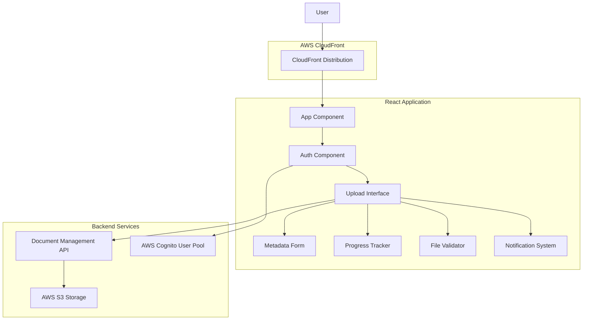
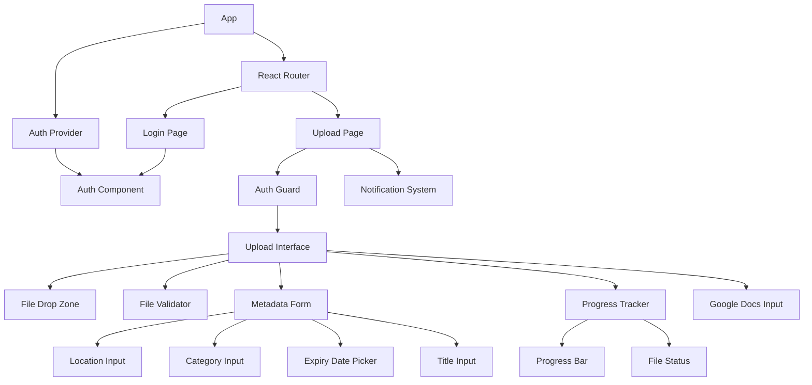

# Design Document: Document Upload UI

## Overview

The Document Upload UI is a React-based web application that provides an intuitive interface for users to upload documents to the document management backend. The application features drag-and-drop functionality, real-time progress tracking, metadata input forms, and comprehensive file validation. Built with modern React patterns and deployed via AWS CloudFront, it offers a responsive and performant user experience across all devices.

## Architecture

### High-Level Architecture



### Component Hierarchy



## Components and Interfaces

### Core Components

#### 1. Upload Interface Component
**Purpose**: Main orchestrator component that manages the upload workflow

**Props Interface**:
```typescript
interface UploadInterfaceProps {
  onUploadComplete?: (files: UploadedFile[]) => void;
  onUploadError?: (error: UploadError) => void;
  maxFileSize?: number; // in bytes
  allowedFileTypes?: string[];
}
```

**State Management**:
```typescript
interface UploadState {
  selectedFiles: File[];
  uploadProgress: Map<string, number>;
  uploadStatus: Map<string, 'pending' | 'uploading' | 'success' | 'error'>;
  metadata: DocumentMetadata;
  isDragActive: boolean;
  validationErrors: ValidationError[];
}
```

#### 2. File Validator Component
**Purpose**: Validates files against type and size constraints

**Validation Rules**:
- Supported file types: PDF, DOC, DOCX, HTML, TXT, PPTX
- Maximum file size: 50MB per file
- MIME type validation for security
- File extension validation as fallback

**Interface**:
```typescript
interface FileValidatorProps {
  files: File[];
  maxSize: number;
  allowedTypes: string[];
  onValidationResult: (result: ValidationResult) => void;
}

interface ValidationResult {
  valid: boolean;
  errors: ValidationError[];
  validFiles: File[];
}
```

#### 3. Metadata Form Component
**Purpose**: Captures document metadata during upload

**Form Fields**:
- **Location** (required): Text input for document location/context
- **Category** (optional): Dropdown with predefined categories + custom input
- **Expiry Date** (optional): Date picker component
- **Title** (optional): Text input for custom document title

**Interface**:
```typescript
interface MetadataFormProps {
  files: File[];
  onMetadataChange: (metadata: DocumentMetadata) => void;
  allowBulkMetadata?: boolean;
}

interface DocumentMetadata {
  location: string;
  category?: string;
  expiryDate?: Date;
  title?: string;
  applyToAll?: boolean; // for bulk uploads
}
```

#### 4. Progress Tracker Component
**Purpose**: Displays real-time upload progress and status

**Features**:
- Individual progress bars for each file
- Overall progress indicator for batch uploads
- Estimated time remaining calculation
- Cancel upload functionality
- Success/error status indicators

**Interface**:
```typescript
interface ProgressTrackerProps {
  uploads: UploadProgress[];
  onCancelUpload: (fileId: string) => void;
}

interface UploadProgress {
  fileId: string;
  fileName: string;
  progress: number; // 0-100
  status: 'uploading' | 'success' | 'error' | 'cancelled';
  error?: string;
  estimatedTimeRemaining?: number;
}
```

#### 5. Auth Component
**Purpose**: Manages user authentication and authorization via AWS Cognito

**Features**:
- AWS Cognito User Pool integration
- Secure token storage and management
- Automatic token refresh
- Login/logout functionality
- Protected route handling

**Interface**:
```typescript
interface AuthComponentProps {
  onAuthStateChange?: (user: CognitoUser | null) => void;
  redirectPath?: string;
}

interface AuthState {
  user: CognitoUser | null;
  isAuthenticated: boolean;
  isLoading: boolean;
  error: AuthError | null;
}

interface CognitoUser {
  username: string;
  email: string;
  organization: string;
  accessToken: string;
  refreshToken: string;
  idToken: string;
}

interface AuthError {
  code: string;
  message: string;
  name: string;
}
```

**Auth Context Provider**:
```typescript
interface AuthContextValue {
  user: CognitoUser | null;
  isAuthenticated: boolean;
  isLoading: boolean;
  login: (username: string, password: string) => Promise<void>;
  logout: () => Promise<void>;
  refreshToken: () => Promise<void>;
  error: AuthError | null;
}
```

#### 6. Notification System Component
**Purpose**: Displays user feedback messages

**Notification Types**:
- Success notifications with auto-dismiss
- Error notifications with manual dismiss
- Warning notifications for validation issues
- Info notifications for guidance

**Interface**:
```typescript
interface NotificationSystemProps {
  notifications: Notification[];
  onDismiss: (id: string) => void;
}

interface Notification {
  id: string;
  type: 'success' | 'error' | 'warning' | 'info';
  title: string;
  message: string;
  autoDismiss?: boolean;
  duration?: number;
}
```

## Data Models

### File Upload Models

```typescript
// Core file model
interface UploadFile {
  id: string;
  file: File;
  metadata: DocumentMetadata;
  status: UploadStatus;
  progress: number;
  error?: UploadError;
}

// Upload status tracking
type UploadStatus = 
  | 'pending'
  | 'validating'
  | 'uploading'
  | 'processing'
  | 'success'
  | 'error'
  | 'cancelled';

// Error handling
interface UploadError {
  code: string;
  message: string;
  details?: any;
}

// API response models
interface UploadResponse {
  documentId: string;
  fileName: string;
  status: 'success' | 'processing';
  message?: string;
}

// Google Docs integration
interface GoogleDocsUpload {
  url: string;
  metadata: DocumentMetadata;
  title?: string;
  preview?: string;
}
```

### API Integration Models

```typescript
// Authentication models
interface CognitoConfig {
  userPoolId: string;
  clientId: string;
  region: string;
  domain?: string;
}

interface AuthTokens {
  accessToken: string;
  idToken: string;
  refreshToken: string;
  expiresAt: number;
}

// Backend API client with authentication
interface DocumentAPIClient {
  uploadFile(file: File, metadata: DocumentMetadata, authToken: string): Promise<UploadResponse>;
  uploadGoogleDoc(url: string, metadata: DocumentMetadata, authToken: string): Promise<UploadResponse>;
  validateFile(file: File): Promise<ValidationResult>;
  cancelUpload(uploadId: string, authToken: string): Promise<void>;
}

// Request/Response formats with auth headers
interface AuthenticatedRequest {
  headers: {
    Authorization: string; // Bearer token
    'Content-Type': string;
  };
}

interface UploadRequest extends AuthenticatedRequest {
  file: FormData;
  metadata: {
    location: string;
    category?: string;
    expiryDate?: string;
    title?: string;
  };
}
```

## Correctness Properties

*A property is a characteristic or behavior that should hold true across all valid executions of a system-essentially, a formal statement about what the system should do. Properties serve as the bridge between human-readable specifications and machine-verifiable correctness guarantees.*

Based on the prework analysis, I've identified properties that can be tested across all inputs and examples that test specific scenarios. After reviewing for redundancy, the following properties provide comprehensive validation coverage:

### File Handling Properties

**Property 1: Drag feedback consistency**
*For any* file drag operation over the upload area, the interface should provide visual feedback indicating the drop zone is active
**Validates: Requirements 1.3**

**Property 2: File acceptance universality**
*For any* valid file dropped on the upload area, the system should accept the file for processing
**Validates: Requirements 1.4**

**Property 3: Batch upload support**
*For any* selection of multiple files, the upload interface should allow batch upload of all selected files
**Validates: Requirements 1.5**

**Property 4: File display consistency**
*For any* selected files, the interface should display their names and sizes before upload begins
**Validates: Requirements 1.6**

### Validation Properties

**Property 5: File type validation**
*For any* file, the validator should correctly identify whether the file type is supported (PDF, DOC, DOCX, HTML, TXT, PPTX)
**Validates: Requirements 2.1**

**Property 6: File size validation**
*For any* file, the validator should correctly determine if the file size is within the allowed limit
**Validates: Requirements 2.2**

**Property 7: Invalid file type rejection**
*For any* unsupported file type, the validator should display an error message and prevent upload
**Validates: Requirements 2.3**

**Property 8: Oversized file rejection**
*For any* file exceeding the size limit, the validator should display a size error message and prevent upload
**Validates: Requirements 2.4**

**Property 9: Upload button state management**
*For any* set of files, when all files pass validation, the upload button should be enabled
**Validates: Requirements 2.5**

### Metadata Properties

**Property 10: Metadata form display**
*For any* file selection, the metadata form should display fields for required metadata
**Validates: Requirements 3.1**

**Property 11: Required field validation**
*For any* form submission, the metadata form should validate that all required fields (location) are completed before allowing upload
**Validates: Requirements 3.2, 3.7**

**Property 12: Optional field functionality**
*For any* metadata input, the form should accept optional expiry dates, categories, and titles
**Validates: Requirements 3.3, 3.4, 3.5**

**Property 13: Bulk metadata handling**
*For any* multiple file upload, the metadata form should allow applying the same metadata to all files or individual metadata per file
**Validates: Requirements 3.6**

### Progress Tracking Properties

**Property 14: Progress display consistency**
*For any* upload in progress, the progress tracker should display a progress bar showing upload completion percentage
**Validates: Requirements 4.1**

**Property 15: Multi-file progress tracking**
*For any* multiple file upload, the progress tracker should show individual progress for each file
**Validates: Requirements 4.2**

**Property 16: Success notification consistency**
*For any* successful upload, the progress tracker should display a success message with the document name
**Validates: Requirements 4.3**

**Property 17: Error handling consistency**
*For any* failed upload, the progress tracker should display a clear error message explaining the failure
**Validates: Requirements 4.4**

**Property 18: Navigation prevention during uploads**
*For any* upload in progress, the interface should prevent users from navigating away without confirmation
**Validates: Requirements 4.5**

**Property 19: Time estimation for large files**
*For any* large file upload, the progress tracker should show estimated time remaining
**Validates: Requirements 4.6**

**Property 20: Upload cancellation**
*For any* upload in progress, the progress tracker should allow users to cancel the upload
**Validates: Requirements 4.7**

### Google Docs Properties

**Property 21: URL validation**
*For any* Google Docs URL input, the validator should verify the URL format is valid
**Validates: Requirements 5.2**

**Property 22: Google Docs API communication**
*For any* valid Google Docs URL submission, the interface should send the URL to the Backend API for processing
**Validates: Requirements 5.3**

**Property 23: Google Docs preview display**
*For any* Google Docs response with available title and preview, the interface should display this information
**Validates: Requirements 5.4**

**Property 24: Invalid Google Docs URL handling**
*For any* invalid or inaccessible Google Docs URL, the interface should display an appropriate error message
**Validates: Requirements 5.5**

**Property 25: Consistent metadata handling**
*For any* Google Docs link, the metadata form should allow users to provide the same metadata options as file uploads
**Validates: Requirements 5.6**

### Responsive Design Properties

**Property 26: Screen size adaptation**
*For any* screen size, the upload interface should adapt and maintain usability
**Validates: Requirements 6.1**

**Property 27: Mobile layout optimization**
*For any* mobile device viewport, the metadata form should stack fields vertically for better accessibility
**Validates: Requirements 6.2**

**Property 28: Touch interaction support**
*For any* mobile device, the upload interface should support touch interactions for drag-and-drop
**Validates: Requirements 6.3**

**Property 29: Progress tracker visibility**
*For any* device size, the progress tracker should remain visible and functional
**Validates: Requirements 6.4**

### Error Handling Properties

**Property 30: Network error messaging**
*For any* network error, the notification system should display user-friendly error messages
**Validates: Requirements 7.1**

**Property 31: API unavailability handling**
*For any* Backend API unavailability, the upload interface should inform users and suggest retry actions
**Validates: Requirements 7.2**

**Property 32: Server error details**
*For any* server error during upload, the notification system should provide specific error details
**Validates: Requirements 7.3**

**Property 33: Success notification display**
*For any* completed upload, the notification system should display success notifications with document names
**Validates: Requirements 7.4**

**Property 34: Validation error highlighting**
*For any* validation error, the notification system should highlight the specific fields that need attention
**Validates: Requirements 7.7**

### Performance Properties

**Property 35: Resumable upload support**
*For any* large file upload interruption, the interface should support resuming the upload
**Validates: Requirements 8.2**

**Property 36: Preference caching**
*For any* user preference or metadata option, the application should cache it for faster subsequent input
**Validates: Requirements 8.3**

**Property 37: Keyboard shortcut functionality**
*For any* defined keyboard shortcut, the interface should respond appropriately
**Validates: Requirements 8.4**

**Property 38: Real-time progress updates**
*For any* upload in progress, the progress tracker should update in real-time without requiring page refreshes
**Validates: Requirements 8.6**

### Authentication Properties

**Property 39: Unauthenticated user redirection**
*For any* unauthenticated user visiting the application, the auth component should redirect them to a login page
**Validates: Requirements 6.1**

**Property 40: Cognito authentication integration**
*For any* valid credentials provided, the auth component should authenticate with AWS Cognito and establish a session
**Validates: Requirements 6.2, 6.3**

**Property 41: Invalid credential handling**
*For any* invalid credentials provided, the auth component should display clear error messages from Cognito
**Validates: Requirements 6.4**

**Property 42: Token security and storage**
*For any* successful authentication, the auth component should store authentication tokens securely in the browser
**Validates: Requirements 6.5**

**Property 43: Token refresh handling**
*For any* expired authentication token, the auth component should automatically refresh the token or prompt for re-authentication
**Validates: Requirements 6.6**

**Property 44: Logout functionality**
*For any* logout action, the auth component should clear the user session and Cognito tokens
**Validates: Requirements 6.7**

**Property 45: User identity display**
*For any* authenticated user, the upload interface should display the user's identity and organization
**Validates: Requirements 6.8**

**Property 46: Protected upload access**
*For any* upload functionality access attempt, the application should only allow authenticated users to proceed
**Validates: Requirements 6.10**

<function_calls>
<invoke name="prework">
<parameter name="featureName">document-upload-ui

## Error Handling

### Error Categories and Handling Strategies

#### 1. Client-Side Validation Errors
**File Type Errors**:
- Display inline error messages next to file selection
- Highlight unsupported files in red with clear messaging
- Provide list of supported file types

**File Size Errors**:
- Show file size limit prominently in UI
- Display current file size vs. limit in error message
- Suggest file compression or splitting for large files

**Form Validation Errors**:
- Highlight required fields with red borders
- Display validation messages below each field
- Prevent form submission until all errors are resolved

#### 2. Network and API Errors
**Connection Errors**:
- Display retry button with exponential backoff
- Show offline indicator when network is unavailable
- Cache form data to prevent loss during network issues

**Server Errors**:
- Parse error responses and display user-friendly messages
- Provide error codes for technical support
- Log detailed error information for debugging

**Authentication Errors**:
- Redirect to login page when session expires
- Display clear authentication failure messages
- Preserve upload state for post-authentication resume
- Handle Cognito-specific error codes and messages

#### 3. Upload Process Errors
**Upload Interruption**:
- Implement automatic retry with exponential backoff
- Provide manual retry option for failed uploads
- Support resumable uploads for large files

**Processing Errors**:
- Display processing status with clear error messages
- Provide option to re-upload failed files
- Show detailed error information for troubleshooting

### Error Recovery Mechanisms

```typescript
interface ErrorRecoveryStrategy {
  retryable: boolean;
  maxRetries: number;
  backoffStrategy: 'linear' | 'exponential';
  userAction?: 'retry' | 'reauth' | 'reselect';
}

const errorStrategies: Record<string, ErrorRecoveryStrategy> = {
  NETWORK_ERROR: {
    retryable: true,
    maxRetries: 3,
    backoffStrategy: 'exponential',
    userAction: 'retry'
  },
  FILE_TOO_LARGE: {
    retryable: false,
    maxRetries: 0,
    backoffStrategy: 'linear',
    userAction: 'reselect'
  },
  AUTH_EXPIRED: {
    retryable: true,
    maxRetries: 1,
    backoffStrategy: 'linear',
    userAction: 'reauth'
  }
};
```

## Testing Strategy

### Dual Testing Approach

The testing strategy employs both unit tests and property-based tests to ensure comprehensive coverage:

**Unit Tests**: Verify specific examples, edge cases, and error conditions
- Component rendering with specific props
- User interaction scenarios (clicks, drags, form submissions)
- API integration with mocked responses
- Error boundary behavior

**Property-Based Tests**: Verify universal properties across all inputs
- File validation with randomly generated files
- Form validation with various input combinations
- Upload progress tracking with different file sizes
- Responsive behavior across viewport ranges

### Property-Based Testing Configuration

**Testing Library**: React Testing Library with fast-check for property generation
**Test Configuration**:
- Minimum 100 iterations per property test
- Each property test references its design document property
- Tag format: **Feature: document-upload-ui, Property {number}: {property_text}**

**Example Property Test Structure**:
```typescript
// Feature: document-upload-ui, Property 5: File type validation
test('file type validation property', () => {
  fc.assert(fc.property(
    fc.record({
      name: fc.string(),
      type: fc.oneof(
        fc.constant('application/pdf'),
        fc.constant('application/msword'),
        fc.constant('text/plain'),
        fc.constant('image/jpeg') // unsupported
      ),
      size: fc.integer(1, 100000000)
    }),
    (fileData) => {
      const file = new File(['content'], fileData.name, { type: fileData.type });
      const result = validateFileType(file);
      
      const supportedTypes = ['application/pdf', 'application/msword', 'text/plain'];
      const expectedValid = supportedTypes.includes(fileData.type);
      
      expect(result.valid).toBe(expectedValid);
    }
  ), { numRuns: 100 });
});
```

### Test Coverage Requirements

**Component Tests**:
- All React components must have unit tests
- Critical user flows must have integration tests
- Error scenarios must be explicitly tested

**Property Tests**:
- Each correctness property must have a corresponding property-based test
- Properties must test universal behaviors across input ranges
- Edge cases should be covered through property generators

**Performance Tests**:
- Upload progress accuracy under various network conditions
- UI responsiveness during large file uploads
- Memory usage during batch uploads

### Testing Tools and Libraries

**Core Testing Stack**:
- **Jest**: Test runner and assertion library
- **React Testing Library**: Component testing utilities
- **fast-check**: Property-based testing library
- **MSW (Mock Service Worker)**: API mocking for integration tests

**Additional Testing Utilities**:
- **@testing-library/user-event**: User interaction simulation
- **jest-axe**: Accessibility testing
- **@testing-library/jest-dom**: Extended DOM matchers

### Continuous Integration

**Test Execution**:
- All tests run on every pull request
- Property tests run with increased iterations in CI (500+ runs)
- Performance tests run on release branches
- Accessibility tests run on all UI changes

**Coverage Requirements**:
- Minimum 90% code coverage for all components
- 100% coverage for critical upload and validation logic
- All correctness properties must have passing tests