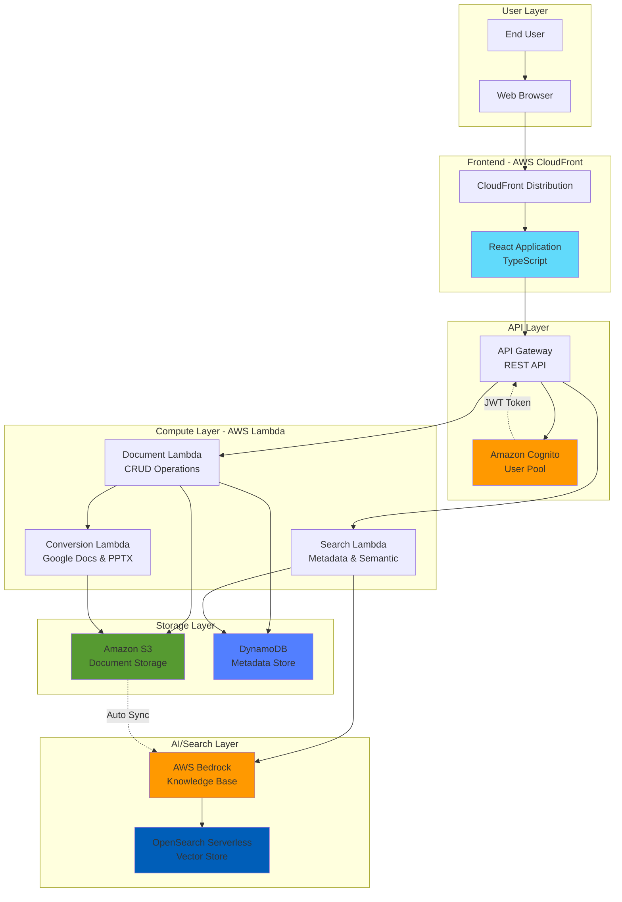
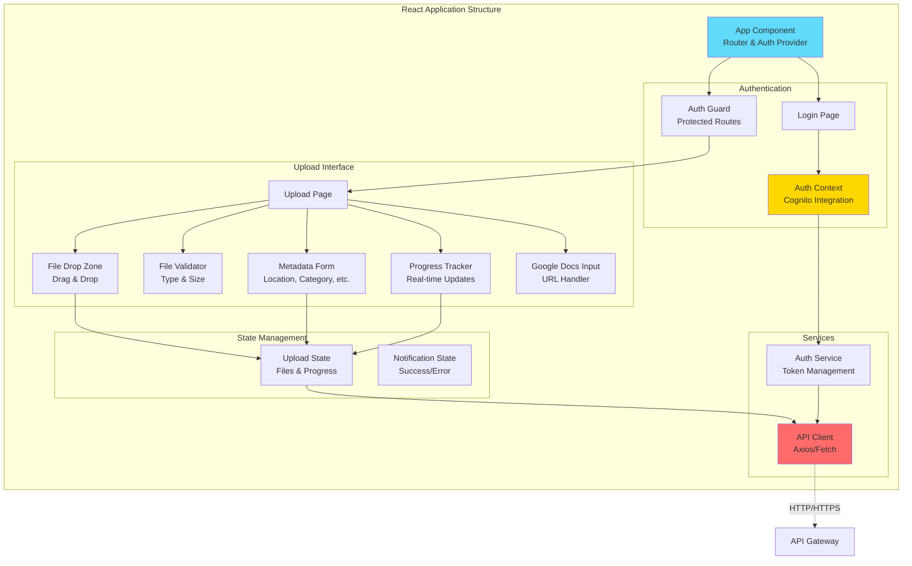
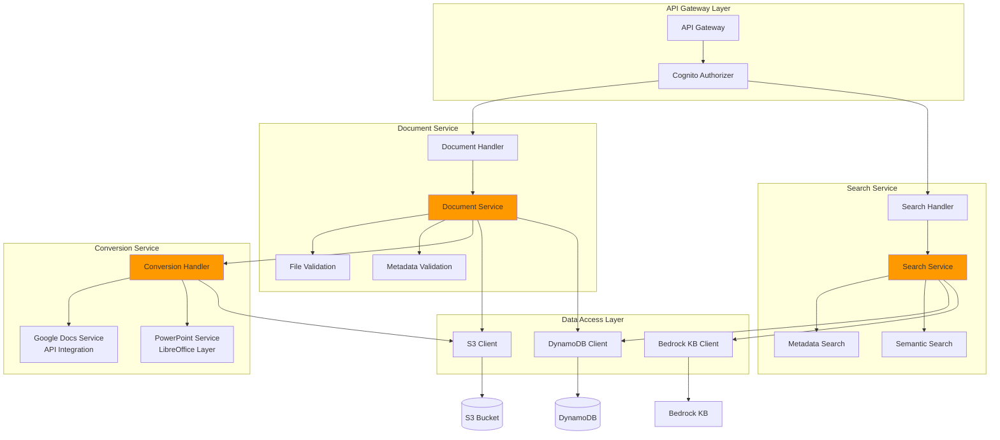
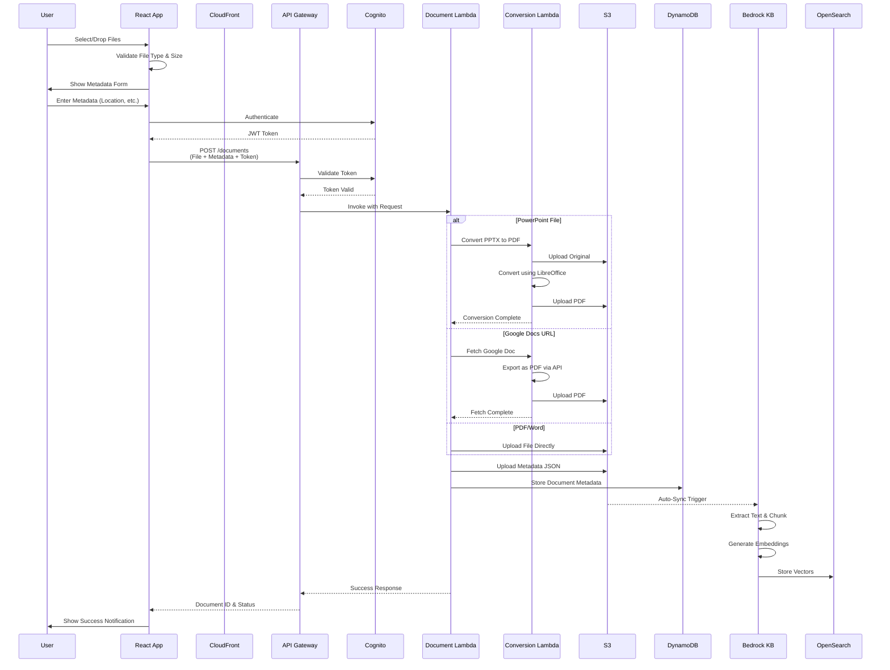
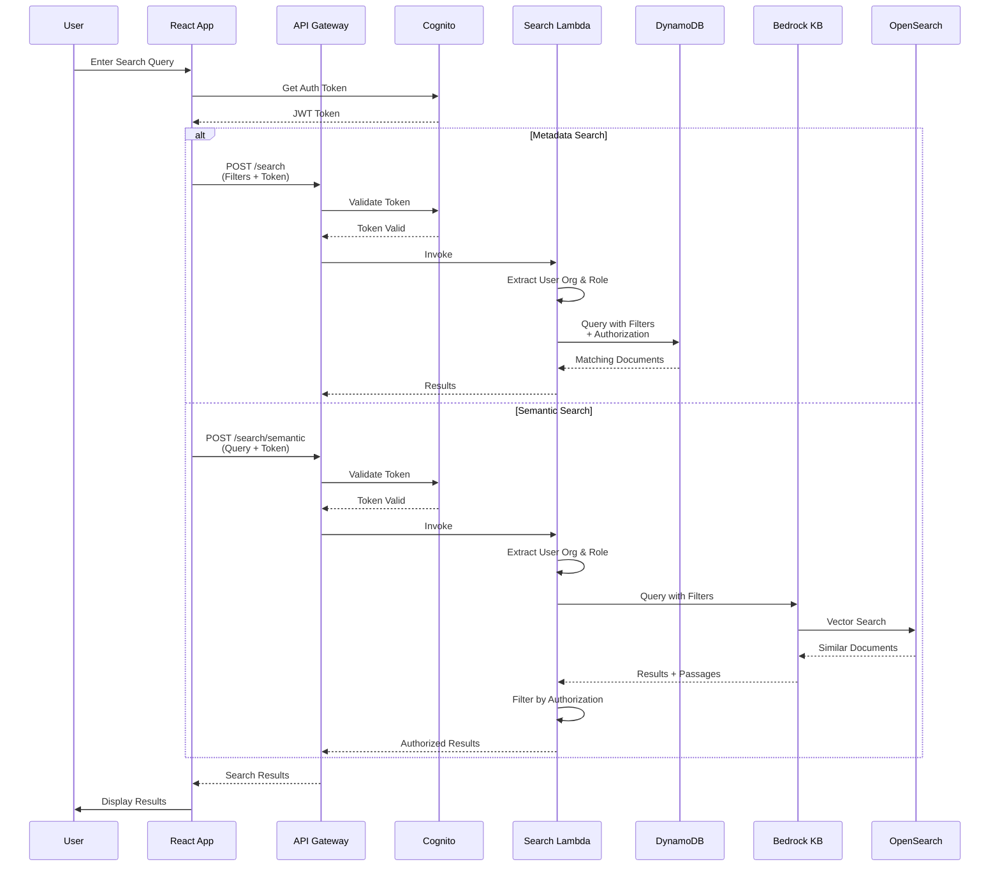
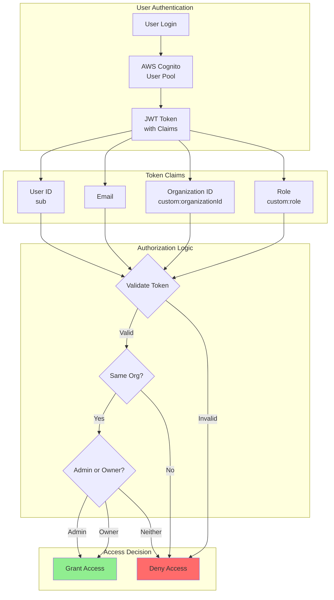
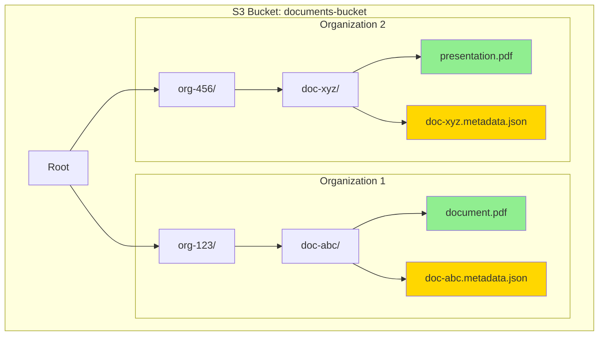
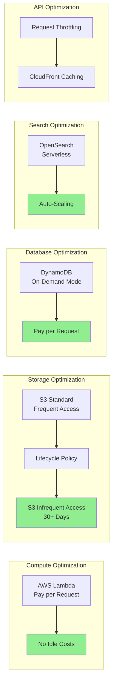
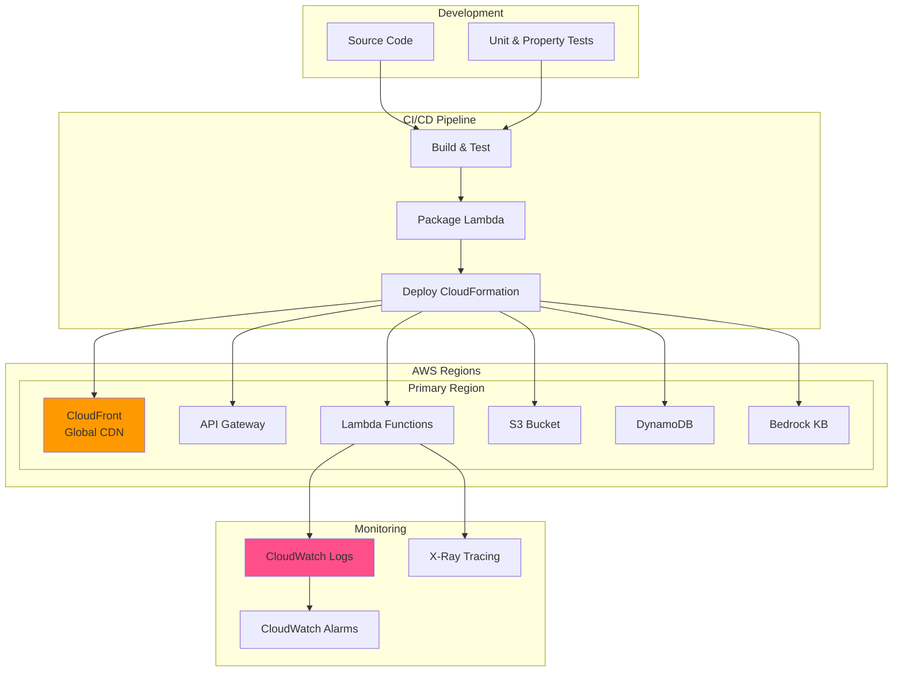
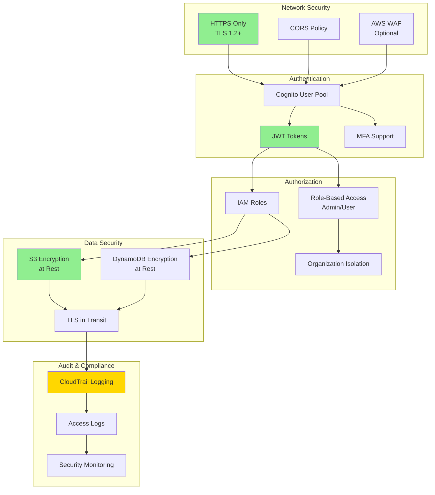

# Document Management System - Architecture

## System Overview

This document provides comprehensive architecture diagrams for the Document Management System, showing how the frontend, backend, and AWS services interact to provide document upload, storage, and semantic search capabilities.

## High-Level System Architecture



## Frontend Architecture



## Backend Service Architecture



## Document Upload Flow



## Search Flow



## Authentication & Authorization Flow



## Data Model - DynamoDB

```mermaid
erDiagram
    DOCUMENTS {
        string PK "DOC#documentId"
        string SK "META"
        string GSI1PK "ORG#organizationId"
        string GSI1SK "USER#userId#createdAt"
        string GSI2PK "ORG#organizationId"
        string GSI2SK "LOC#location#createdAt"
        string id
        string userId
        string organizationId
        string fileName
        string fileExtension
        string s3Key
        string location
        string category
        number sensitivity
        string expiryDate
        number version
        string status
        string createdAt
        string updatedAt
    }
    
    USERS {
        string userId
        string email
        string organizationId
        string role
    }
    
    ORGANIZATIONS {
        string organizationId
        string name
    }
    
    USERS ||--o{ DOCUMENTS : uploads
    ORGANIZATIONS ||--o{ USERS : contains
    ORGANIZATIONS ||--o{ DOCUMENTS : owns
```

## S3 Bucket Structure



## Cost Optimization Strategy



## Deployment Architecture



## Security Architecture



## Technology Stack Summary

### Frontend
- **Framework**: React 18 with TypeScript
- **State Management**: React Context API
- **HTTP Client**: Axios
- **Testing**: Jest, React Testing Library, fast-check
- **Hosting**: AWS CloudFront + S3
- **Build Tool**: Create React App

### Backend
- **Runtime**: Node.js 18 (AWS Lambda)
- **Language**: TypeScript
- **API**: REST via API Gateway
- **Authentication**: AWS Cognito
- **Testing**: Jest, fast-check

### Storage & Data
- **Object Storage**: Amazon S3
- **Database**: Amazon DynamoDB
- **Vector Store**: Amazon OpenSearch Serverless

### AI & Search
- **Knowledge Base**: AWS Bedrock Knowledge Bases
- **Embeddings**: Amazon Titan Embeddings V2
- **Chunking**: Bedrock automatic semantic chunking

### DevOps
- **IaC**: AWS CloudFormation / CDK
- **CI/CD**: GitHub Actions / AWS CodePipeline
- **Monitoring**: CloudWatch, X-Ray
- **Logging**: CloudWatch Logs

## Key Design Decisions

1. **Serverless Architecture**: Minimizes operational overhead and costs
2. **Bedrock Knowledge Bases**: Automatic text extraction and semantic search without custom ML
3. **Multi-Tenant Design**: Organization-based isolation for data security
4. **Event-Driven Processing**: S3 triggers automatic KB sync
5. **Cost Optimization**: Lifecycle policies, on-demand pricing, serverless components
6. **Property-Based Testing**: Ensures correctness across all input ranges
7. **JWT Authentication**: Stateless, scalable authentication with Cognito
8. **Metadata-First Search**: Fast filtering before semantic search for efficiency

---

*This architecture is designed for scalability, cost-efficiency, and maintainability while providing powerful document management and AI-powered search capabilities.*
